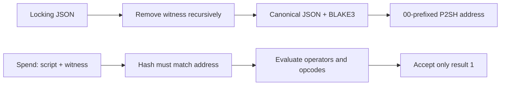

# RustScript Developer Guide

RustScript is Saito's symbolic pay-to-script-hash (P2SH) language. A locking script is hashed into a P2SH address; a later transaction supplies the same script plus `witness` data, and the spend succeeds only when the script returns `1`. The same evaluator can also gate application data. It is currently used by the RustScript workstation and by Store, Stack, Vault, and Archive workflows for programmable payments, NFT ownership, and access control.

## Contents

- [How validation works](#validation)
- [Opcodes](#opcodes)
- [Requesting an opcode](#requesting-opcodes)
- [Operators and primitives](#operators-and-primitives)
- [Syntax and formatting](#syntax-and-formatting)
- [Copy/paste examples](#examples)

<a id="validation"></a>

## How validation works



Objects are canonicalized with sorted keys, arrays retain their order, and whitespace is ignored. Every `witness` property is removed before hashing, so witness data may be added without changing the commitment. A P2SH spend carries one JSON-encoded script in `tx.msg.access_scripts` for each P2SH input. Consensus recomputes its hash, compares it with the input's address, seeds the runtime context, and executes the tree.

The browser's `app.core.scripting.evaluate*` API calls the same Rust evaluator through WASM. The JavaScript opcode files under `mods/rustscript/lib/opcodes/` supply editor metadata and previews; the consensus source of truth is `saito-core/src/core/consensus/scripting/`. There is no separate schema-validation pass in consensus: unknown opcodes, missing fields, invalid types, unavailable context, bad signatures, and failed conditions all return `0`.

<a id="opcodes"></a>

## Opcodes

Field names are case-sensitive. `witness.*` fields are supplied at unlock/evaluation time; the other fields are committed by the locking-script hash.

| Opcode             | Inputs                                                                            | Returns `1` when…                                                                                                                                                                   |
| ------------------ | --------------------------------------------------------------------------------- | ----------------------------------------------------------------------------------------------------------------------------------------------------------------------------------- |
| `CHECKHASH`        | `hash`; `witness.input`                                                           | `BLAKE3(input)` equals the 64-character hex hash.                                                                                                                                   |
| `CHECKSIG`         | `publickey`, `msg`; `witness.signature`                                           | The Saito signature verifies against the resolved message and public key.                                                                                                           |
| `CHECKMULTISIG`    | `publickeys[]`, optional `m`, optional `msg`; `witness.signatures[]`              | At least `m` signatures match distinct keys. Missing/invalid `m` defaults to all keys; missing `msg` falls back to `variables.message` (normally empty).                            |
| `CHECKSENDER`      | `publickey`; transaction                                                          | Any `tx.from` slip has that public key.                                                                                                                                             |
| `CHECKRECIPIENT`   | `publickey`; transaction                                                          | Any `tx.to` slip has that public key.                                                                                                                                               |
| `CHECKOWN`         | `utxokey`; transaction and blockchain                                             | The UTXO is unlocked and the transaction signature verifies against its first input.                                                                                                |
| `CHECKOWNNFT`      | `witness.utxokey1..3`; transaction and blockchain                                 | The keys form an NFT tuple, its spendable slips are unlocked, and the custody owner's transaction signature verifies. The UI's legacy `nftid` field is not checked by consensus.    |
| `CHECKOWNNFTWHERE` | optional `where[]`; `witness.utxokey1..3`; transaction and blockchain             | `CHECKOWNNFT`-style ownership passes and every `creator`/`type` clause using `==` or `!=` passes. Exposes `__opcodes.checkownnftwhere.nft_id`.                                      |
| `CHECKPATH`        | `publickey`, optional `hash`; `witness.hops[]`                                    | Every routing hop is signed by the preceding authority over `BLAKE3(to\|base64_value\|hash)`.                                                                                       |
| `CHECKPATHHOP`     | `publickey`, `selector`, optional `hash`, `where[]`, `assert[]`; `witness.hops[]` | The path verifies, base64 hop values decode as JSON, filtering and assertions pass, and `FIRST`, `LAST`, `ONLY`, or `ANY` selects a hop. Exposes `__opcodes.checkpathhop.hop`.      |
| `CHECKTIME`        | `timestamp`, `operator`; block                                                    | The block timestamp satisfies `==`, `!=`, `<`, `<=`, `>`, or `>=`. **Current WASM and P2SH transaction entry points do not provide a block, so this opcode currently fails there.** |
| `CHECKFIELD`       | `field`, `operator`, `value`                                                      | Resolved values of the same scalar type compare successfully. Numbers/strings support `==` (or `equals`), `!=`, `<`, `<=`, `>`, `>=`; booleans support equality/inequality.         |
| `IMPORTFIELD`      | `key`, `publickey`, `hash`; `witness.value`, `witness.signature`                  | A string/integer value is signed over `BLAKE3(value\|hash)`. Stores it at `__opcodes.importfield.<key>`.                                                                            |
| `IMPORTARRAY`      | `key`, `publickey`, `hash`; `witness.value[]`, `witness.signature`                | The canonical array is signed over `BLAKE3(canonical_json(value)\|hash)`. Stores it at `__opcodes.importarray.<key>`.                                                               |
| `SUMFIELDS`        | `a`, `b`, `into`                                                                  | Two resolved unsigned integers are added and stored at `__opcodes.sumfields.<into>`.                                                                                                |
| `SETFIELD`         | `reference`, `value`                                                              | The resolved value is copied to the writable `context.*` destination.                                                                                                               |
| `SETARRAY`         | `destination`, `source`                                                           | A resolved source array is deep-copied to the writable `context.*` destination.                                                                                                     |
| `SETARRAYFIELD`    | `destination`, `source`, `field`                                                  | A field is written on every object in a destination array. A scalar broadcasts; a short array repeats its last value.                                                               |
| `ARRAYIFY`         | `reference`, `dimension`                                                          | A context value is replaced by that many deep clones. A number supplies the count; an array/object supplies its length.                                                             |

`SETARRAY`, `SETARRAYFIELD`, and `ARRAYIFY` also understand the collection references `tx.from`, `tx.to`, `tx.path`, `tx.from.p2sh`, and `tx.to.p2sh`. Mutation opcodes only write beneath `context.*`; writes to `script`, `witness`, `tx`, or `blk` are rejected.

<a id="requesting-opcodes"></a>

> ## Requesting an opcode
>Opcodes are consensus rules, not runtime plug-ins. Propose a new opcode to the Saito maintainers with its exact JSON fields, deterministic success/failure rules, required transaction/blockchain context, cost bounds, security implications, and positive/negative test vectors. Implementation requires a Rust handler, registration in the consensus dispatcher, tests, and matching RustScript editor metadata; deployment must be coordinated across validating nodes.

<a id="operators-and-primitives"></a>

## Operators and primitives

- `AND` evaluates children left-to-right and stops on the first `0`.
- `OR` evaluates children left-to-right and stops on the first `1`.
- `NOT` evaluates and inverts its first child.

Logical nodes use `{"op":"AND|OR|NOT","args":[...]}`. The UI requires at least two children for `AND`/`OR` and exactly one for `NOT`. Order matters when a child writes to `__opcodes`: put producers such as `IMPORTFIELD` or `SUMFIELDS` before consumers such as `CHECKFIELD`, and remember that short-circuiting can skip later children. The text generator also parses `THEN`, but the consensus evaluator does not implement it; do not publish scripts containing `THEN`.

JSON strings, booleans, unsigned integers, arrays, and objects are the practical value types. String operands beginning with these namespaces are dereferenced:

| Reference                                             | Value                                                                                         |
| ----------------------------------------------------- | --------------------------------------------------------------------------------------------- |
| `script.*`, `witness.*`                               | Current opcode's committed fields or witness fields.                                          |
| `tx.*`, `blk.*`                                       | Serialized transaction or block fields, when that context is available.                       |
| `tx.from.p2sh.utxoset_key`, `tx.from.p2sh.public_key` | Current P2SH input's fields; `tx.to.p2sh.*` addresses the first matching output.              |
| `__opcodes.*`                                         | Values written by earlier opcodes.                                                            |
| `NOW`                                                 | Block timestamp, otherwise transaction timestamp, otherwise local Unix time, in milliseconds. |
| `REQUESTER`                                           | First transaction input's public key.                                                         |

An unresolved prefixed reference becomes `null`; any other string remains a literal. `vars.*` exists as an internal resolver hook but is not populated by the current public UI/WASM API.

Advanced leaf nodes may contain an object-valued `reference`; the evaluator treats its properties as committed witness defaults and overlays `witness` on top. Unlike `witness`, `reference` remains in the script hash. `required` is editor scaffolding, not a consensus primitive.

<a id="syntax-and-formatting"></a>

## Syntax and formatting

Canonical RustScript is JSON. Use one root object, uppercase opcode names, exact lowercase field names, double quotes, and no comments or trailing commas. Opcode values are case-insensitive during execution, but uppercase is conventional. Two-space indentation does not affect the hash; object-key order also does not affect it, while array order does.

```json
{
  "op": "AND",
  "args": [
    { "op": "CHECKHASH", "hash": "..." },
    { "op": "CHECKRECIPIENT", "publickey": "..." }
  ]
}
```

The **New Script → Custom Script** generator additionally accepts a compact expression syntax:

```text
CHECKHASH[hash="..."] AND (NOT CHECKSENDER[publickey="..."])
```

Its operands are opcode names with optional `[field=value, ...]` lists. Values may be double-quoted strings, integers (including negative integers), booleans, or bare/dotted identifiers. Parentheses group expressions; precedence is `NOT`, `AND`, `OR`. It cannot express arrays or nested objects, so use the Expert JSON editor for multisig keys, clauses, paths, and witnesses.

Locking scripts should not contain `witness`. In the RustScript UI, paste locking JSON into **Create Script**, move to **Test Script**, and supply the generated witness fields there. Publishing commits only the witness-free view.

<a id="examples"></a>

## Copy/paste examples

These are locking scripts. In the RustScript app choose **Expert Mode**, paste one into **Create Script**, replace angle-bracket placeholders, and leave the editor (blur) to apply it.

### 1. Secret-locked payment

```json
{
  "op": "CHECKHASH",
  "hash": "ea8f163db38682925e4491c5e58d4bb3506ef8c14eb78a86e908c5624a67200f"
}
```

This locks SAITO or an NFT to knowledge of a preimage. In **Test Script**, set `witness.input` to `hello`; the included hash is the real BLAKE3 digest used by the core test fixture. Use a high-entropy secret in production—`hello` is only a demonstration.

### 2. Store buyer-or-store approval

```json
{
  "op": "CHECKMULTISIG",
  "m": 1,
  "publickeys": ["<BUYER_OR_SELLER_PUBLIC_KEY>", "<STORE_PUBLIC_KEY>"],
  "msg": "tx.from.p2sh.utxoset_key"
}
```

This is the pattern generated by Store for listing and purchase custody: either the customer-side key or the store key may authorize the spend. The Test Script needs one signature over the P2SH input's resolved UTXO-set key in `witness.signatures`.

### 3. Stack private-post NFT access

```json
{
  "op": "CHECKOWNNFTWHERE",
  "where": [
    {
      "field": "type",
      "operator": "==",
      "value": "stack"
    },
    {
      "field": "creator",
      "operator": "==",
      "value": "<AUTHOR_PUBLIC_KEY>"
    }
  ]
}
```

This is Stack's transferable private-post access pattern. The requester supplies the NFT's three UTXO keys as `witness.utxokey1`, `utxokey2`, and `utxokey3`; evaluation also needs the signed request transaction and blockchain state, so test it by importing the relevant transaction rather than with context-free evaluation.
