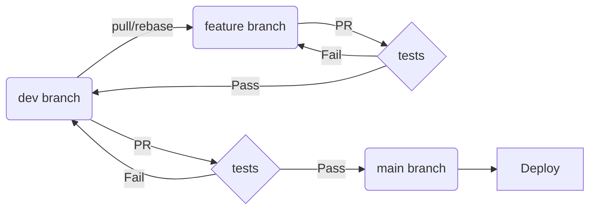

# Development Workflow

## General Dev Pattern





### Notes

* New development should start with a pull and rebase:
```
   git checkout dev
   git pull
   git checkout -b new-branch-name
```
* Branches can only be merged to the dev branch via Pull Requests
* The dev branch can only be merged into main via a Pull Request
* Tests include linting and style checks