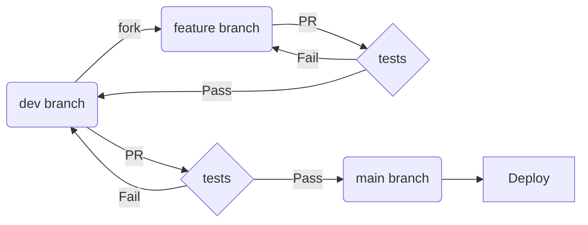

# Development Workflow

## General Dev Pattern

### Notes

* Branches can only be merged to the dev branch via Pull Requests
* The dev branch can only be merged into main via a Pull Request
* Tests include linting and style checks